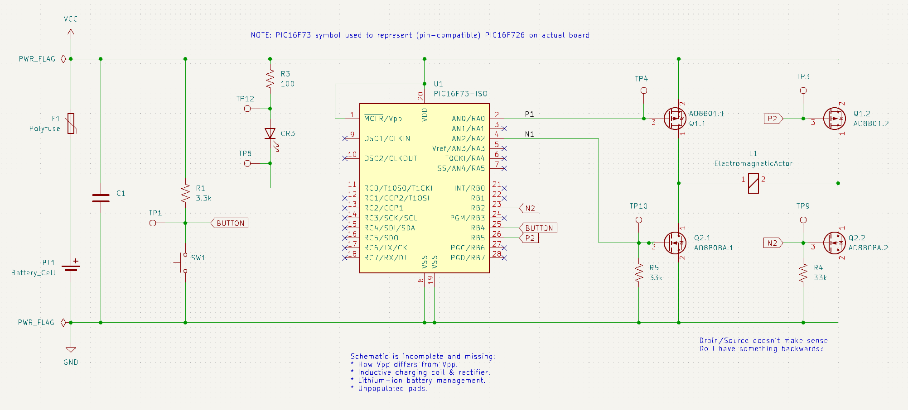

# Sonicare HX6530 Actuator Control (Partial)

This is a [KiCad](https://www.kicad.org/) project with a partial schematic
of the control circuit board from a Sonicare HX6530. Just what I could
reverse-engineer by looking at traces and probing with a continuity meter,
with a focus on components relating to controlling the brush actuator.

No guarantee of accuracy, this mostly serves as notes to bring my future self
up to speed on what I had been up to.

A (possibly outdated) snapshot of the partial schematic:

